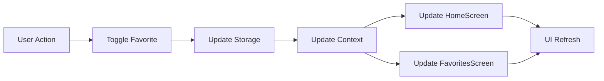

# 📱 Mobile App Feature Specification

A beautiful React Native mobile application for managing and favoriting users from an external API. Features a modern UI with background images, real-time search, and favorite management across multiple tabs.

## ✨ Features

### 🌐 API Integration
- **Base URL**: `https://reqres.in/api/users`
- **Pagination**: Automatically fetches all pages (2 pages total)
- **Mock Data**: Falls back to mock users if API fails

### 🎨 UI Design
- **Background Images**: Beautiful gradient backgrounds from Unsplash API
- **Prominent Name Display**: User names are prominently featured on each card
- **Glass-morphism Design**: Modern semi-transparent UI elements
- **Responsive Layout**: Works on all screen sizes

### 🧭 Navigation
- **Two Tabs**: 
  - **All Users**: Complete user list with search functionality
  - **Favorites**: Filtered view of favorited users
- **Custom Tab Bar**: Stylish tab navigation with active state indicators

### 🔍 Search Functionality
- **Real-time Search**: Filters users by name as you type
- **Clear Search**: Easy clear button to reset search
- **No Index Display**: Clean list without numbers

### ❤️ Favorite Management
- **Star Button**: Tap star icon to add/remove favorites
- **Real-time Sync**: Changes reflect immediately across both tabs
- **Persistent Storage**: Favorites saved locally using AsyncStorage
- **Global State**: Shared favorite state using React Context

## 📸 Screenshots

**Home Screen**:
- Purple gradient header
- Search bar
- User cards with avatar, name, email, and star button
- Real-time filtering

**Favorites Screen**:
- Same beautiful background
- Favorites counter
- Only favorited users
- Remove favorites directly

## 🏗️ Project Structure

```
UserFavoritesApp/
├── App.js                          # Main app component with navigation
├── app.json                        # Expo configuration
├── package.json                    # Dependencies
├── index.js                        # App entry point
├── src/
│   ├── components/
│   │   ├── TabBar.js              # Custom tab navigation
│   │   ├── UserCard.js            # User card with favorite button
│   │   └── SearchBar.js           # Search input component
│   ├── screens/
│   │   ├── HomeScreen.js          # All users screen
│   │   └── FavoritesScreen.js     # Favorites screen
│   ├── services/
│   │   └── api.ts                 # API service with user fetching
│   ├── utils/
│   │   └── storage.ts             # AsyncStorage for favorites
│   └── context/
│       └── FavoritesContext.js     # Global state management
```

## 🚀 Installation

### Prerequisites
- Node.js (v14 or newer)
- npm or yarn
- Expo CLI (optional)

### Steps

1. **Clone or extract the project**
   ```bash
   # If you have the ZIP file
   unzip UserFavoritesApp.zip
   cd UserFavoritesApp
   ```

2. **Install dependencies**
   ```bash
   npm install
   # or
   yarn install
   ```

3. **Install Expo Go on your phone** (for mobile testing)
   - iOS: [App Store](https://apps.apple.com/app/expo-go/id982107779)
   - Android: [Play Store](https://play.google.com/store/apps/details?id=host.exp.exponent)

4. **Run the app**
   ```bash
   npx expo start
   ```

5. **Choose your preview method**:
   - **Mobile**: Scan QR code with Expo Go app
   - **Web**: Press `w` in terminal or open `http://localhost:8081`
   - **Android Emulator**: Press `a` in terminal
   - **iOS Simulator**: Press `i` in terminal (macOS only)

## 📱 Usage Guide

### Adding Favorites
1. Open the **All Users** tab
2. Tap the ☆ star icon on any user card
3. Star turns to ★ (filled) indicating added to favorites

### Removing Favorites
**Option 1**: Tap the ★ star icon again in **All Users** tab
**Option 2**: Tap the ★ star icon in **Favorites** tab

### Searching Users
1. Type in the search bar at the top
2. List filters in real-time by name
3. Tap "×" to clear search

### Switching Tabs
- Tap **All Users** to see all users
- Tap **Favorites** to see only favorited users
- Blue underline indicates active tab

## 🔧 Technical Details

### Dependencies
```json
{
  "expo": "~50.0.0",
  "react": "18.2.0",
  "react-native": "0.73.0",
  "@react-navigation/native": "^6.1.0",
  "@react-navigation/bottom-tabs": "^6.5.0",
  "react-native-vector-icons": "^10.0.0",
  "axios": "^1.6.0",
  "@react-native-async-storage/async-storage": "1.21.0"
}
```

### Key Components

#### **FavoritesContext**
- Global state management for favorites
- Real-time synchronization between screens
- Persistent storage integration

#### **UserCard Component**
- Displays user avatar, name, and email
- Interactive star button
- Responsive design with shadows

#### **SearchBar Component**
- Real-time filtering
- Clear button functionality
- Glass-morphism design

## 🎨 Design System

### Colors
- **Primary**: `#667eea` (Purple gradient)
- **Accent**: `#FFD700` (Gold for favorite stars)
- **Background**: Unsplash gradient image with dark overlay
- **Cards**: Semi-transparent white with shadows

### Typography
- **Titles**: Bold, large with text shadows
- **User Names**: Prominent, 20px, bold
- **Body Text**: Regular weight with good contrast

### Shadows & Effects
- Cards have elevation and soft shadows
- Text shadows for readability on backgrounds
- Blurred background images
- Glass-morphism effect on search bar

## 🔄 State Flow



## 🧪 Testing

### Manual Testing Checklist
- [x] Users load from API
- [x] Search filters correctly
- [x] Favorite toggle works
- [x] Favorites persist between app restarts
- [x] Real-time sync between tabs
- [x] Pull-to-refresh works
- [x] Empty states display properly
- [x] Tab navigation works


## 📱 Platform Support

- **iOS**: 13.0+
- **Android**: 8.0+
- **Web**: Modern browsers


## 🙏 Acknowledgments

- [ReqRes.in](https://reqres.in/) for the free user API
- [Unsplash](https://unsplash.com/) for background images
- [React Navigation](https://reactnavigation.org/) for routing
- [Expo](https://expo.dev/) for development tools


